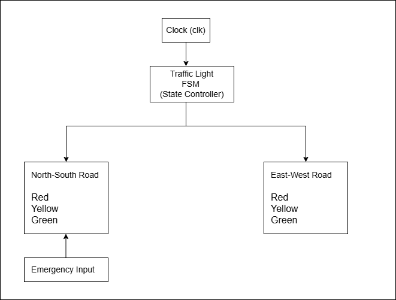
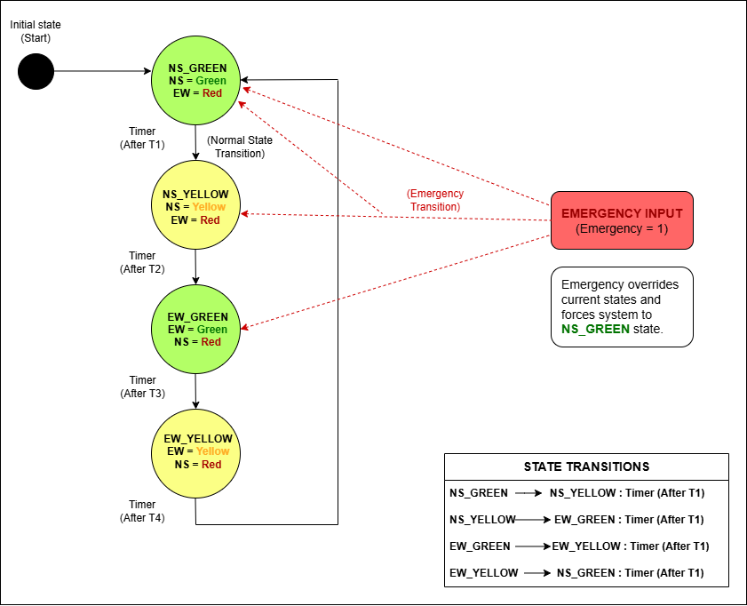
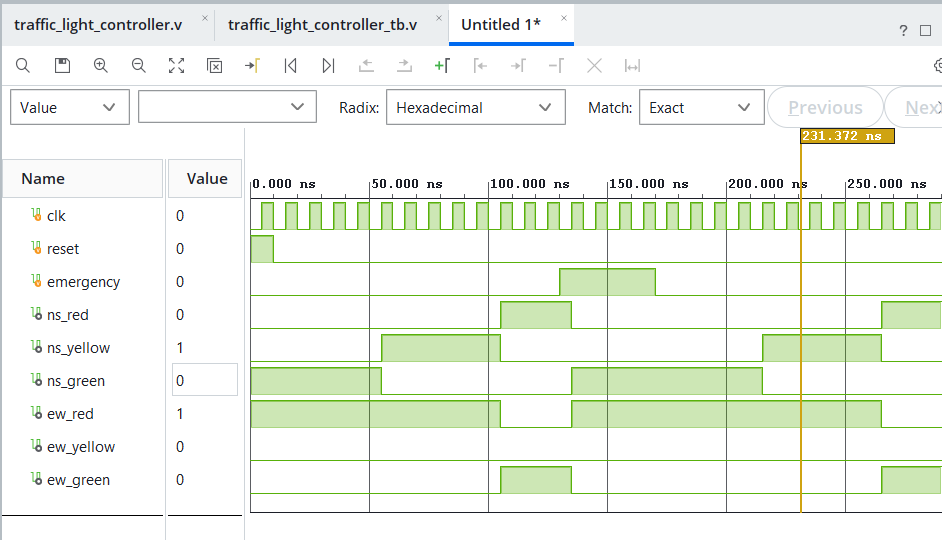

# Traffic Light Controller using Verilog HDL

## Block Diagram

## FSM State Diagram

## Overview
This project implements a Traffic Light Controller using Verilog HDL based on a Finite State Machine (FSM). The controller manages traffic flow between the North-South and East-West roads by cycling through Green and Yellow signal states. An emergency input is also implemented to immediately prioritize the North-South road.

## Features
- Finite State Machine (FSM) based architecture
- Independent North-South and East-West traffic control
- Green, Yellow and Red signal management
- Emergency vehicle priority mode
- Behavioral simulation and verification in Xilinx Vivado

## Tools and Technologies
- Verilog HDL
- Xilinx Vivado 2026.1
- Draw.io
- GitHub

## Repository Structure
- traffic_light_controller.v (Main Verilog module)
- traffic_light_controller_tb.v (Testbench)
- block_diagram.drawio.png (Block Diagram)
- state_diagram.png (FSM State Diagram)

## FSM State Sequence

NS_GREEN
↓
NS_YELLOW
↓
EW_GREEN
↓
EW_YELLOW
↓
NS_GREEN (repeats)

### Emergency Mode
Whenever the emergency input is asserted, the controller immediately switches to the North-South Green state, allowing priority traffic to pass safely.

## Simulation Results
The design was verified using a dedicated Verilog testbench in Xilinx Vivado Behavioral Simulation. Waveforms were analyzed to confirm correct state transitions, emergency handling and signal timing.

## Simulation Waveform

## Author
Sachita Reddy

## Future Improvements

- FPGA implementation on Xilinx development board
- Configurable traffic timing
- Pedestrian crossing support
- Multiple intersection control
